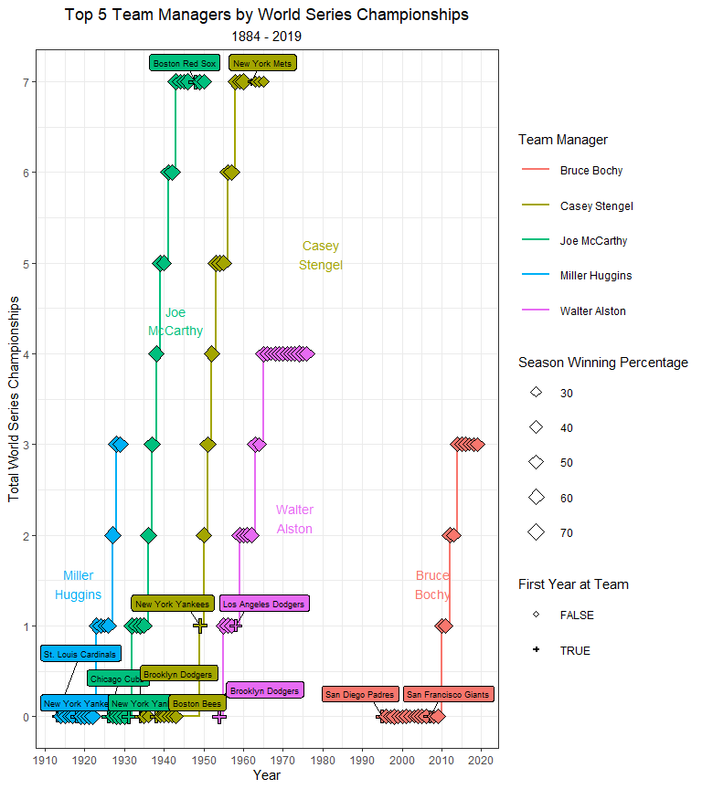
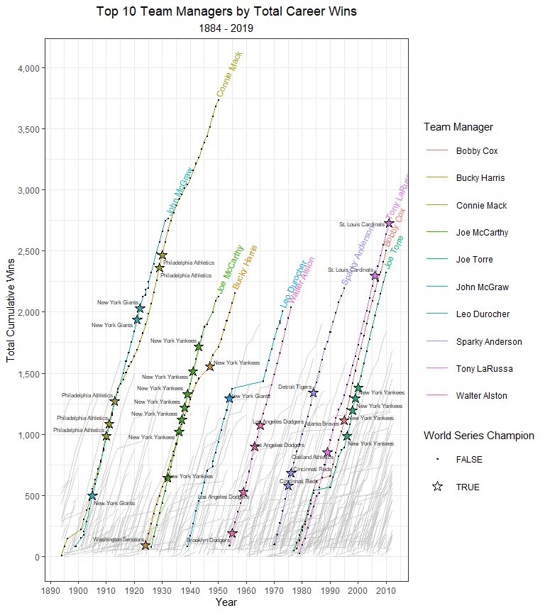
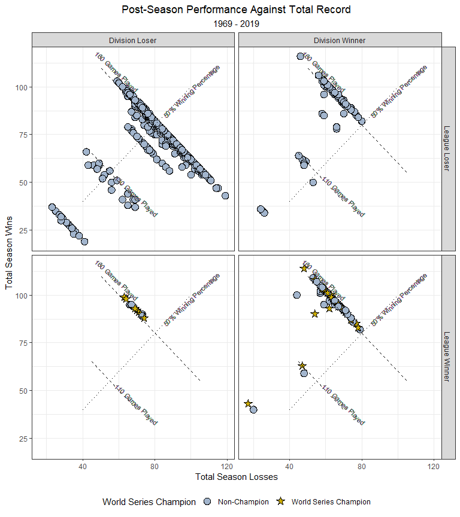

 
 
 

Data from this analysis is thanks to Sean Lahman. The R package 'Lahman' is used to load this data. For more information see the documentation at  http://www.seanlahman.com/files/database/readme2017.txt.

 
 

The data will be formatted and visualized by means of the 'tidyverse' and 'ggplot2' R packages and Tableau.

### Top Team Managers

We'll take a look at the most successful team managers since 1884. This will be done by looking at most wins and most World Series Championships.

By manipulating the Managers and Teams tables in the 'Lahman' package, we can get our dataset started. 

\newpage

Determining the performance of managers can be from numerous perspectives. We'll begin with the metric used to determine the best team each year: World Series Championships.

Below are the top 5 coaches by World Series Championships. Showing the cumulative championships by manager, irrespective of the team that they managed.

<!-- -->

 

\newpage

Another perspective is to consider the total number of wins a manager is able to lead their teams to.

 

<!-- -->

\newpage 

### Regular vs. Post Season Performance 

<!-- -->

